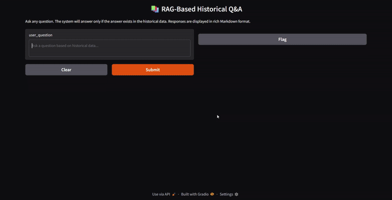

# 🚀 RAG Query Assistant

A FastAPI-based ⚡ Retrieval-Augmented Generation (RAG) system with Gradio UI 🎨 to answer user queries from historical JSON data using Google's Gemini Flash LLM 💬.

---

## 📖 Project Description

The **RAG Query Assistant** is an intelligent question-answering system that:

* 📂 Loads historical knowledge from a **JSON dataset**.
* 🔍 Retrieves relevant context using **Chroma vector database** and **Google Embeddings**.
* 🤖 Generates accurate responses using **Google Gemini Flash 2.0 LLM**.
* 🖥️ Provides a user-friendly **Gradio web interface** for interaction.
* 🚀 Powered by **FastAPI backend** with CORS integration.

---

## 🖥️ Project Demo


---
## 🛠️ Tech Stack

* **FastAPI** - API backend
* **LangChain** - RAG orchestration and prompt management
* **Gradio** - Frontend UI
* **Chroma DB** - Vector store for document retrieval
* **Google Generative AI (Gemini Flash)** - LLM for response generation
* **Google Text Embeddings** - Document embedding
* **Docker** - Containerization
* **Python** - Core language
* **Git** - Version Control
---

## 🚀 Setup Instructions

### 1. Clone the Repo

```bash
git clone https://github.com/ltd-ARYAN-pvt/RAG-Query-Assistant.git
cd RAG-Query-Assistant
```

### 2. Setup Environment Variables

Create a `.env` file:

```text
GOOGLE_API_KEY=your_google_api_key
Api=Your_API
Login=your_login_credential
Pass=Password
```

### 3. Setup Virtual Environment

```bash
python -m venv venv
```
activate the python virtual env
```bash
.\venv\Scripts\Activate.ps1
```

### 4. Install Dependencies

```bash
pip install -r requirements.txt
```

### 5. Run the App

```bash
python app.py
fastapi dev main.py
```
in different terminal

### 6. Access Gradio UI

Visit: [http://localhost:7860](http://localhost:7860)

---

## 🐳 Docker Support

### Build Docker Image

```bash
docker build -t rag-query-assistant .
```

### Run Docker Container

```bash
docker run -p 7860:7860 rag-query-assistant
```

---

## 📝 .gitignore

```gitignore
venv/
env/
__pycache__/
chroma_db/
gradio/
.env
```

---

## 📝 .dockerignore

```dockerignore
venv/
env/
__pycache__/
chroma_db/
gradio/
.git
```

---

## ✨ Features

* ✅ FastAPI backend with modular structure
* ✅ Google Gemini Flash LLM integration
* ✅ JSON-based knowledge base support
* ✅ Chunked context retrieval using Chroma DB
* ✅ Gradio-based interactive UI
* ✅ Dockerized for easy deployment

---

## 💡 Future Enhancements

* Add support for multiple file types (PDF, CSV)
* Authentication for query history tracking
* Pagination in Gradio UI for large responses
* GPU-based LLM integration
---